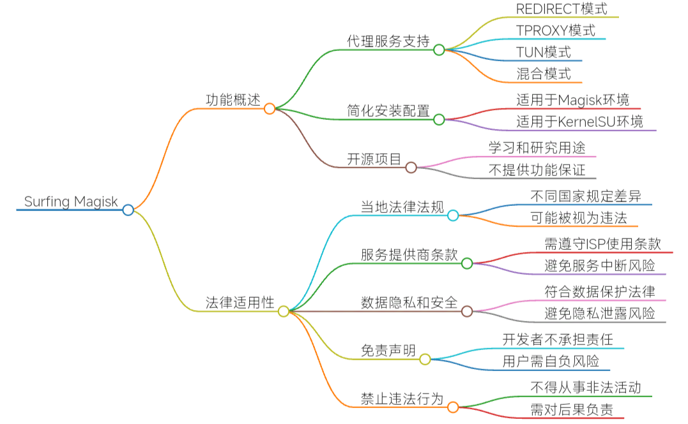

---
hide:
  - navigation
  - toc
---
  
**Surfing** 旨在简化在 Android 设备上实现软路由服务的安装和配置。它主要用于在 [Magisk](https://github.com/topjohnwu/Magisk) 、 [Kernelsu](https://github.com/tiann/KernelSU) 、 [APatch](https://github.com/bmax121/APatch)  环境中运行，支持多种代理模式，包括 TCP 和 UDP 的透明代理（TPROXY）以及混合模式链式代理。  

## 主要特点

Surfing 通过提供一站式服务，帮助用户更轻松地配置 Clash、sing-box、v2ray 和 xray 等工具。它特别适合小白和不想深入技术细节的白嫖党用户

- **多种代理模式**：该模块支持多种代理模式，包括 REDIRECT（仅 TCP）、TPROXY（TCP + UDP）和 TUN（TCP + UDP），使用户能够根据需要选择合适的网络配置
- **使用免责声明**：使用 Surfing 模块的用户需自行承担使用风险。该项目不提供任何形式的功能或性能保证，开发者对因使用该项目而导致的任何损失或问题不承担责任

## 使用要求

- **环境要求**：用户需要在具有 root 权限的 Android 设备上安装 Magisk 或 KernelSU，以便使用 Surfing 模块。安装后，用户需根据相关文档进行配置，以确保模块正常运行。
- **备份建议**：在使用 Surfing 之前，建议用户备份设备数据和设置，以防止意外情况导致的数据丢失或设备损坏
  
旨在为用户提供便捷的网络解决方案。